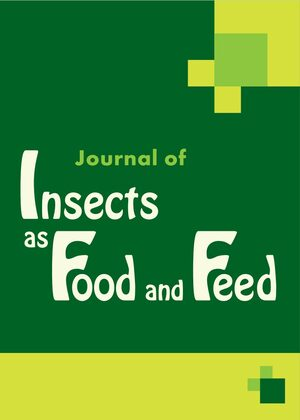

```{r load packages, echo=F, message=F, warning=F, include=FALSE}
library(tidyverse)
library(readxl)
library(reactable)
library(leaflet)
library(htmltools)
library(ggExtra)
library(patchwork)

Sys.setlocale("LC_TIME", "English")
```


```{r load data, echo=F, message=F, warning=F}
chapters <- read_excel("data/bugbook_data.xlsx", sheet = "chapters")
contributions <- read_excel("data/bugbook_data.xlsx", sheet = "contributions")
```


<body>

```{r calculations, echo=F, message=F, warning=F, include=F}
author_number <- contributions %>% 
  distinct(Author) %>% 
  nrow()

country_number <- contributions %>% 
  distinct(Country) %>% 
  nrow()

institution_number <- contributions %>% 
  distinct(Institution) %>% 
  nrow()

institution_freq <- contributions %>% 
  group_by(Institution) %>% 
  summarize(count = n()) %>% 
  arrange(desc(count))

country_freq <- contributions %>% 
  group_by(Country) %>% 
  summarize(count = n()) %>% 
  arrange(desc(count))

```

<br>

# What to expect

<div style="text-align: justify;">

The BugBook project was initiated and coordinated by David Deruytter (Inagro, Belgium), and brings together expertise from across Europe and beyond to address the growing need for standardized research in the field of industrial insect rearing. Comprising 13 chapters (**Table 1**), the BugBook project provides a comprehensive and open access manual for researchers and professionals working on the production of insects for food and feed, with a particular focus on harmonizing methodologies and experimental design. The most frequently used words (**Figure 1**) illustrate the scope and thematic focus of the project.

</div>

<br>

```{r wordcloud, echo=F, message=F, warning=F, fig.align='left',}
# Load required libraries
library(tm)
library(wordcloud)
library(wordcloud2)
library(RColorBrewer)
library(htmlwidgets)
library(webshot)

# Set the path to your corpus directory
corpus_dir <- "data/corpus"

# Create a text corpus from the directory
corpus <- VCorpus(DirSource(corpus_dir), readerControl = list(language = "en"))

# Preprocess the text
corpus <- tm_map(corpus, content_transformer(tolower))           # Convert to lowercase
corpus <- tm_map(corpus, removePunctuation)                      # Remove punctuation
corpus <- tm_map(corpus, removeNumbers)                          # Remove numbers
corpus <- tm_map(corpus, removeWords, stopwords("en"))           # Remove English stopwords
corpus <- tm_map(corpus, stripWhitespace)                        # Remove extra whitespace

# Create a document-term matrix
dtm <- TermDocumentMatrix(corpus)
m <- as.matrix(dtm)
word_freqs <- sort(rowSums(m), decreasing = TRUE)
df <- data.frame(word = names(word_freqs), freq = word_freqs)

# Select only the top 50 words (or any number you prefer)
df_subset <- head(df, 100)  # Change 50 to your desired number

# Plot the oval wordcloud with fewer words
set.seed(123) # for reproducibility
wc <- wordcloud2(
  data = df_subset,
  size = 0.8,
  minSize = 0,
  shape = 'circle',
  ellipticity = 0.4,
  minRotation = -pi/4,
  maxRotation = pi/4,
  rotateRatio = 0.4,
  color = c("#D5E03C", "#D5E03C"))

# Save as HTML file
saveWidget(wc, "assets/wordcloud.html", selfcontained = TRUE)


```

<iframe src="assets/wordcloud.html" width=100% height="400" style="border:none;"></iframe>

<figcaption>
  <b>Figure 1. Word cloud constructed from the 100 most frequently used words used across all chapters of the BugBook.</b>
</figcaption>

<br>

# BugBook chapters

<div style="text-align: justify;">

<figure style="float: right; margin: 0 0 1em 1em; width: 150px; text-align: justify; font-size: 9pt;">
  
  <figcaption style="margin-top: 0.5em; font-style: italic;">
    The BugBook was published in the <i><a href="https://brill.com/view/journals/jiff/jiff-overview.xml">Journal of Insects as Food and Feed.</a></i>
  </figcaption>
</figure>

As research on insect farming has rapidly expanded, driven by advances in genetics, processing, and sustainability, the lack of standardized data analysis and experimental protocols has become a significant barrier to progress and comparability across studies. The BugBook project directly addresses this gap by providing guidance on standardizing processing methods, refining feeding trial protocols, and outlining best practices for chemical analysis of insect biomass. It also introduces conceptual approaches to genetic research, diversity management, and selective breeding, all of which are crucial for the sustainable development of insects as food and feed. By integrating these diverse yet interconnected topics, the BugBook serves as a comprehensive resource that fosters harmonization and innovation in insect research, ultimately accelerating the responsible utilization of insects in food, feed, and waste valorization systems.

Building on a foundation of good practices, the BugBook provides detailed guidelines for maintaining laboratory populations of key species such as <i>Tenebrio molitor</i> and <i>Hermetia illucens</i>, ensuring reproducibility and integrity in research (**Table 1**). It covers critical aspects of experimental design for insect production, including nutritional requirements, hazard and ecotoxicological safety, and the assessment of insect behavior under mass-rearing conditions. The project also addresses the evaluation and application of insect frass in agricultural and waste systems, emphasizing the importance of microbiome analysis and the interactions between multiple environmental stressors.

</div>

<figcaption>
  <b>Table 1. Overview of the 13 BugBook chapters.</b> Click on the arrows to expand the abstract and further information.
</figcaption>

```{r chapters, echo=F, message=F, warning=F}
reactable(chapters, 
          columns = list(
            Chapter = colDef(name = "#",
                             maxWidth = 40,
                             align = "center"),
            First_Author = colDef(name = "First author",
                                  minWidth = 150),
            Title = colDef(name = "Title",
                           html = TRUE,
                           minWidth = 500),
            Received = colDef(show = FALSE),
            Accepted = colDef(show = FALSE),
            Published_online = colDef(show = FALSE),
            Authors = colDef(show = FALSE),
            Abstract = colDef(show = FALSE),
            Keywords = colDef(show = FALSE),
            DOI = colDef(name = "DOI",
                         minWidth = 50,
                         html = TRUE,
                         cell = function(value) {
                           sprintf('<a href="%s" target="_blank">Link</a>', value)
                         }
                        )
          ),
          details = function(index) {
            row <- chapters[index, ]
            htmltools::div(
              style = "margin: 16px 24px;",  # Top/bottom 16px, left/right 24px
              htmltools::tags$b("Author info: "), row$Authors, 
              htmltools::br(), htmltools::br(),
              htmltools::tags$b("Keywords: "), row$Keywords, 
              htmltools::br(), htmltools::br(),
              div(
                style = "text-align: justify;",
                htmltools::tags$b("Abstract: "), row$Abstract
              )
            )
          },
          compact = TRUE,
          striped = TRUE,
          defaultPageSize = 15, 
          highlight = TRUE
        )
```

<br>


# International network

<div style="text-align:justify;">

In total, `r author_number` authors from `r institution_number` institutions located in `r country_number` countries have contributed to the BugBook. Authors collaborating on a specific chapter clearly cluster together spatially (<b>Figure 2</b>), while some authors contributing to two or more chapters (<span style="color:#D5E03C;"><b>light green</b></span>) become visible as "hubs" connecting clusters of authors in between chapters (<span style="color:#006225;"><b>dark green</b></span>).

</div>

```{r network, echo=F, message=F, warning=F, out.width="100%"}
library(dplyr)
library(igraph)
library(visNetwork)

edges <- contributions %>% 
  dplyr::group_by(Chapter) %>%
  summarise(Authors = list(unique(Author)), .groups = "drop") %>%
  pull(Authors) %>%
  lapply(function(x) if(length(x) >= 2) t(combn(x, 2)) else NULL) %>%
  Filter(Negate(is.null), .) %>%
  do.call(rbind, .) %>%
  as.data.frame() %>%
  setNames(c("from", "to"))

# Create graph
g <- graph_from_data_frame(edges, directed = FALSE)

# Create nodes/edges for visNetwork
nodes <- data.frame(
  id = V(g)$name, 
  label = V(g)$name,  # Show labels by default
  font.size = 20,      # Larger text
  color = "#006225"    # Node color
)

# Assign colors based on degree condition
author_counts <- contributions %>% 
  count(Author) %>% 
  filter(n >= 2)

nodes$color <- ifelse(nodes$id %in% author_counts$Author, "#D5E03C", "#006225")

edges_vis <- as_data_frame(g, what = "edges")

# Create interactive plot with stabilization
network <- visNetwork(nodes, edges_vis) %>%
  visOptions(
    highlightNearest = list(enabled = TRUE, degree = 1),
    nodesIdSelection = FALSE
  ) %>%
  visPhysics(  # Stabilization settings
    stabilization = list(
      enabled = TRUE,
      iterations = 200,
      fit = TRUE
    ),
    solver = "barnesHut",  # Better for larger networks
    barnesHut = list(
      gravitationalConstant = -12000,  # Adjust for node spacing
      springLength = 150
    )
  ) %>%
  visLayout(randomSeed = 7)

network
```


<figcaption>
  <b>Figure 2. Interactive network of collaboration patterns.</b> Use scroll to zoom in and out, and click and drag a node to explore and expand the network.
</figcaption>


<br>


# Find an expert near you

<div style="text-align:justify;">

The geographical distribution (<b>Figure 3</b>) of people that have contributed to the BugBook project (**Table 2**) clearly shows a Europe-centered focus. The majority of authors are located in `r country_freq$Country[1]`, `r country_freq$Country[2]`, and `r country_freq$Country[3]`. The institution with the highest number of contributions was `r institution_freq$Institution[1]`. 

</div>

```{r author map, echo=F, message=F, warning=F, out.width="100%"}

contributions %>%
  group_by(Author, ORCID, Institution, City, Country, Lat, Long) %>%
  summarise(
    Chapters = paste(sort(unique(Chapter)), collapse = ", "),
    .groups = "drop") %>% 
  leaflet() %>%
  addProviderTiles(providers$CartoDB.Positron) %>% 
  #addTiles() %>%  # Adds the default OpenStreetMap map tiles
  addCircleMarkers(
    ~Long, ~Lat,
    popup = ~paste(
      "<b>Author: </b>", Author, ifelse(!is.na(ORCID), 
                                        paste("<a href='", ORCID, "'>[ORCID]</a>"),
                                        ""),
      "<br><b>Institute: </b>", Institution, # institution
      "<br><b>Chapter(s): </b>", Chapters # chapters
    ), 
    clusterOptions = markerClusterOptions(
      spiderfyOnMaxZoom = TRUE,  # Enable spiderfy
      showCoverageOnHover = FALSE,
      zoomToBoundsOnClick = TRUE),
    radius = 10,              # Point size
    color = "#006225",      # Vibrant orange for visibility
    fillOpacity = 0.8,
  )
```

<figcaption>
  <b>Figure 3. Interactive map showing the geographical distribution of the people that contributed to the BugBook.</b> Scroll or click on nodes to zoom in. Click on dark green nodes to show the respective author information.
</figcaption>

<br>

## Searchable list of authors

<figcaption>
  <b>Table 2. Overview of all contributing authors</b>. It includes their primary affiliations, ORCID identifiers, and keywords extracted from the chapters to which they contributed to help find relevant experts for a specific topic.
</figcaption>

```{r author list, echo=F, message=F, warning=F}
unique_authors <- read_excel("data/bugbook_data.xlsx", sheet = "unique_authors")

# Function to aggregate keywords for each author
get_keywords_for_author <- function(Authors, chapters) {
  # Find rows where the author appears in the Authors list
  matched_rows <- sapply(chapters$Authors, function(x) str_detect(x, fixed(Authors)))
  # Extract and combine keywords
  all_keywords <- unlist(strsplit(paste(chapters$Keywords[matched_rows], collapse = ", "), ",\\s*"))
  # Remove duplicates and collapse back to string
  unique_keywords <- unique(trimws(all_keywords))
  paste(unique_keywords, collapse = ", ")
}

unique_authors$Keywords <- sapply(unique_authors$Authors, get_keywords_for_author, chapters = chapters)


unique_authors %>% 
  mutate(ORCID = ifelse(
    startsWith(ORCID, "https:"), 
    paste0("<a href='", ORCID, "'>", str_remove(ORCID, "https://orcid.org/"), "</a>"),
    "")) %>% 
  reactable(
    columns = list(
      "#" = colDef(maxWidth = 40),
      Authors = colDef(minWidth = 70),
      Institution = colDef(minWidth = 120),
      ORCID = colDef(html = TRUE)
      ), 
    searchable = TRUE, 
    highlight = TRUE, 
    compact = TRUE, 
    showPageSizeOptions = TRUE, 
  )

```

<br>


# Further information

## Timeline and stats

All manuscripts were submitted within December 2024 and were published online latest 11 months after initial submission. 

```{r timeline, echo=F, message=F, warning=F, fig.width=12, fig.height=10}
main <- chapters %>% 
  #mutate(Label = ifelse(Chapter == 0, paste0("Editorial\n", First_Author),
  #                      paste0("Chapter ", Chapter, "\n", First_Author))) %>%
  mutate(Label = ifelse(Chapter == 0, paste0("Editorial"),
                        paste0("Chapter ", Chapter))) %>% 
  select(Chapter, Label, Received, Accepted, Published_online) %>% 
  pivot_longer(cols = 3:5, names_to = "Status", values_to = "Date") %>% 
  mutate(Status = factor(Status, levels = c("Received", "Accepted", "Published_online")),
         Date = as.Date(Date, "%Y-%m-%d", tz = "UTC")) %>% 
  group_by(Label) %>% 
  ggplot(aes(x = reorder(Label, desc(Chapter)), y = Date)) +
  geom_line() +
  geom_point(aes(color = Status), size = 4) +
  scale_color_manual(values = c("#9E2A2B", "#006225", "#D5E03C"),
                     labels = c("Received", "Accepted", "Online")) +
  scale_y_date(date_breaks = "months", date_labels = "%b %y", ) +
  labs(x = NULL,
       y = NULL) +
  ggpubr::theme_pubclean() +
  coord_flip() +
  theme(legend.position = "bottom",
        legend.title = element_blank(),
        axis.text = element_text(size = 11),
        axis.text.x = element_text(angle = 30, hjust = 1))

# Add marginal density plot
a <- ggMarginal(main, type = "density", margins = "x", size = 6,
           groupColour = TRUE, groupFill = TRUE)

institution_freq <- contributions %>% 
  group_by(Institution) %>% 
  summarize(count = n()) %>% 
  arrange(desc(count))

b <- ggplot(institution_freq %>% 
         filter(!is.na(Institution)) %>% 
         slice_max(n = 10, order_by = count), 
       aes(x = reorder(Institution, count), y = count)) +
  geom_bar(fill = "#006225", stat = 'identity', position = 'dodge') +
  scale_x_discrete() +
  scale_y_continuous(breaks = seq(0, 18, 3), limits = c(0, 18)) +
  labs(y = "Number of authors", x = NULL) +
  ggpubr::theme_pubclean() +
  theme(axis.text = element_text(size = 11)) +
  coord_flip()

authors_per_chapter <- contributions %>%
  group_by(Chapter) %>%
  summarise(UniqueAuthors = n_distinct(Author)) %>% 
  left_join(chapters %>% select(Chapter, First_Author)) %>% 
  mutate(Chapter = as.numeric(Chapter),
         UniqueAuthors = as.numeric(UniqueAuthors),
         #ID = paste0("(", Chapter, ") ", First_Author))
         ID = ifelse(Chapter > 0, paste0("Chapter ", Chapter), "Editorial"))
  

# Authors per chapter
c <- ggplot(authors_per_chapter, aes(x = reorder(ID, UniqueAuthors), y = UniqueAuthors)) +
  geom_bar(stat = "identity", fill = "#006225") +
  scale_y_continuous(breaks = seq(0, 22, 3)) +
  theme_minimal() +
  labs(x = NULL, 
       y = "Number of authors")  +
  ggpubr::theme_pubclean() +
  theme(axis.text = element_text(size = 11)) +
  coord_flip()

bc <- b + c
wrap_plots(list(a, bc), nrow = 2, heights = c(0.6, 0.4)) + plot_annotation(tag_levels = "A")

```

<figcaption>
  <b>Figure 4. Overview of selected statistics.</b> <b>A.</b>  Timeline of chapter submissions, acceptances, and online publications. <b>B.</b> Institutional rankings based on the number of contributions to BugBook chapters (Top 10). <b>C.</b> Number of authors per chapter.
</figcaption>

<br>

## Data used for this post

The raw data used in this post can be downloaded [here](data/bugbook_data.xlsx). Feel free to use, adapt, and share this work in any way you like.

## Links to other projects

- [Black Soldier Fly Biowaste processing: A Step-by-Step Guide (2nd Edition)](https://www.eawag.ch/fileadmin/Domain1/Abteilungen/sandec/schwerpunkte/swm/Practical_knowhow_on_BSF/BSF_Biowaste_Processing_2nd_Edition_HR.pdf) by Dortmans et al. (2021)
- [COST Action CA23127](https://www.cost.eu/actions/CA23127/) - Group on Insect Nutrition: To Open Nutritional Innovative Challenges (GIN-TONIC)
- [COST Action CA22140](https://www.cost.eu/actions/CA22140/) - Improved Knowledge Transfer for Sustainable Insect Breeding (Insect-IMP)